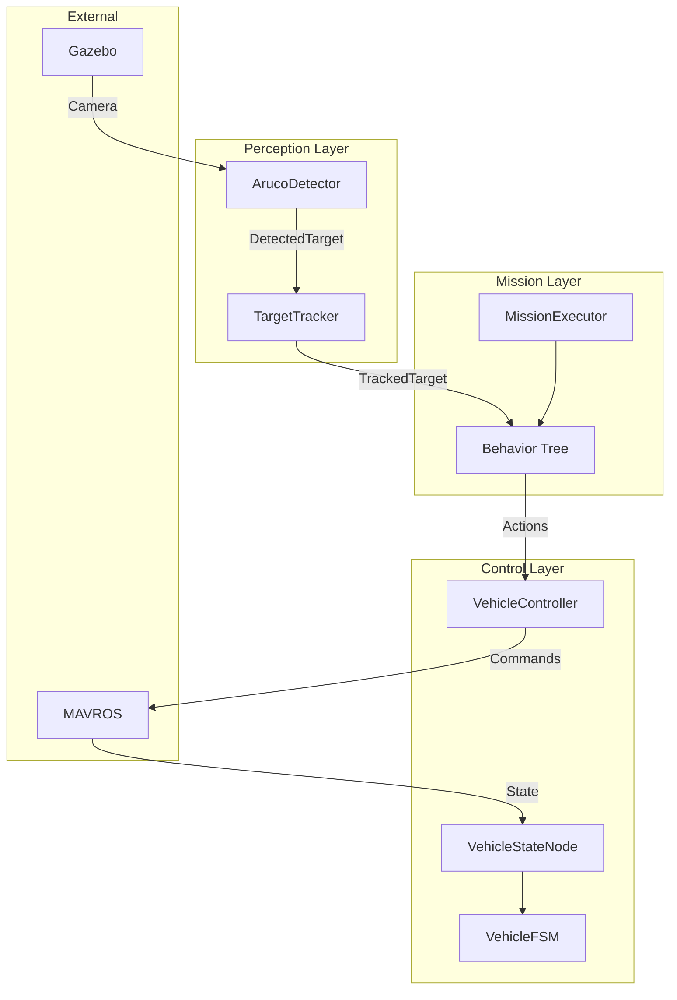

# Session 20: Documentation & Portfolio

**Phase:** 5 - Integration & Polish
**Estimated Duration:** 3-4 hours
**Difficulty:** Low-Medium
**PROJECT GATE:** This session completes the project

---

## Prerequisites

- [ ] All previous sessions complete
- [ ] CI passing
- [ ] Demo recordings available

---

## Learning Objectives

By the end of this session, you will understand:

1. **Technical documentation** - API docs, architecture diagrams
2. **Portfolio presentation** - showcasing work effectively
3. **Demo creation** - GIFs, videos for README
4. **Code cleanup** - removing debug code, consistent style

---

## Practical Objectives

### Primary Goal
Create portfolio-ready documentation and clean up the codebase.

### Deliverables

1. **Update README.md:**
   - Project overview with demo GIF
   - Architecture diagram
   - Quick start guide
   - Feature list with status

2. **Create architecture documentation:**
   - System diagram (nodes, topics, actions)
   - Package dependency graph
   - Data flow diagram

3. **Code cleanup:**
   - Remove debug prints
   - Consistent docstrings
   - Remove commented-out code
   - Verify all TODOs resolved

4. **Create demo materials:**
   - GIF of search-approach mission
   - Screenshot of Gazebo simulation
   - Terminal output examples

---

## Session Structure

| Time | Activity |
|------|----------|
| 0:00-0:30 | Code cleanup pass |
| 0:30-1:00 | Create architecture diagrams |
| 1:00-1:30 | Record demo GIF/video |
| 1:30-2:15 | Update README completely |
| 2:15-2:45 | Create quick start guide |
| 2:45-3:15 | Final review and polish |
| 3:15-3:30 | Tag release, celebrate! |

---

## Verification Checklist

```bash
# 1. Code cleanup
grep -r "print(" src/  # Should only show intentional logging
grep -r "TODO" src/    # Should be 0 or documented

# 2. Documentation builds
# README renders correctly on GitHub

# 3. Quick start works
# Follow your own instructions from scratch

# 4. Demo GIF loads
# Check README on GitHub

# 5. All tests pass
make test
```

---

## README Template

```markdown
# SH-UAV-Platform


> Autonomous UAV platform for visual target detection and approach using ArUco markers.


## Features

- 🚁 **Autonomous Flight Control** - Takeoff, land, navigate
- 🔍 **Visual Detection** - ArUco marker detection and tracking
- 🎯 **Visual Servoing** - Position-based approach to targets
- 🌳 **Behavior Trees** - Modular mission framework

## Architecture


## Quick Start

### Prerequisites
- Docker & Docker Compose
- X11 (for Gazebo visualization)

### Run Simulation
```bash
# Clone repository
git clone https://github.com/Shadow-Harvest/sh-uav-platform
cd sh-uav-platform

# Start development environment
make dev

# Inside container: build
colcon build --symlink-install
source install/setup.bash

# Run demo mission
ros2 launch uav_mission search_approach.launch.py
```

## Package Overview

| Package | Purpose |
|---------|---------|
| `uav_msgs` | Custom ROS2 messages and actions |
| `uav_control` | Vehicle control, FSM, action servers |
| `uav_perception` | ArUco detection and target tracking |
| `uav_mission` | Behavior tree mission framework |

## Documentation

- [Architecture Overview](docs/architecture.md)
- [Development Guide](docs/development.md)
- [Testing Guide](docs/testing.md)

## License

MIT
```

---

## Architecture Diagram (Mermaid)



---

## Code Cleanup Checklist

- [ ] Remove all `print()` statements (use logger)
- [ ] Remove commented-out code blocks
- [ ] Ensure all TODOs are resolved or tracked
- [ ] Add docstrings to public classes/methods
- [ ] Consistent naming conventions
- [ ] Remove unused imports
- [ ] Format with black/autopep8

---

## Demo Recording Tips

**For GIF:**
```bash
# Record screen with OBS or similar
# Convert to GIF:
ffmpeg -i demo.mp4 -vf "fps=10,scale=800:-1" demo.gif
```

**Keep it short:** 15-30 seconds
**Focus on:** Takeoff → Search rotation → Approach → Hover → Land

---

## Potential Blockers

| Issue | Symptom | Resolution |
|-------|---------|------------|
| GIF too large | >10MB, GitHub won't show | Reduce resolution/fps |
| Mermaid not rendering | Diagram shows as code | Use mermaid.live, export PNG |
| Demo fails during recording | Murphy's Law | Have backup recording |

---

## Code Locations

- README: `README.md`
- Docs: `docs/`
- Images: `docs/images/`

---

## Definition of Done

- [ ] README updated with all sections
- [ ] Architecture diagram created
- [ ] Demo GIF/video created
- [ ] Quick start guide tested
- [ ] Code cleanup complete
- [ ] All TODOs resolved
- [ ] CI passing
- [ ] Tagged release (v1.0.0)

---

## Project Completion Criteria

Before declaring the project complete, verify:

- [ ] Full mission runs autonomously in SITL
- [ ] All unit tests pass
- [ ] CI pipeline green
- [ ] README is comprehensive and professional
- [ ] Demo materials showcase the project well
- [ ] Code is clean and well-documented
- [ ] Learning logs capture the journey

---

## 🎉 Congratulations!

You've completed a full autonomous UAV project including:
- ROS2 package development
- Finite state machines
- Computer vision (ArUco detection)
- Control systems (visual servoing)
- Behavior trees
- Testing and CI/CD

This is portfolio-ready work demonstrating:
- Systems thinking
- Software architecture
- Robotics fundamentals
- Professional development practices

---

## What's Next? (Optional Extensions)

Ideas for continuing the project:
- Add YOLO object detection
- Implement GPS-denied navigation
- Add obstacle avoidance
- Multi-drone coordination
- Deploy on real hardware
